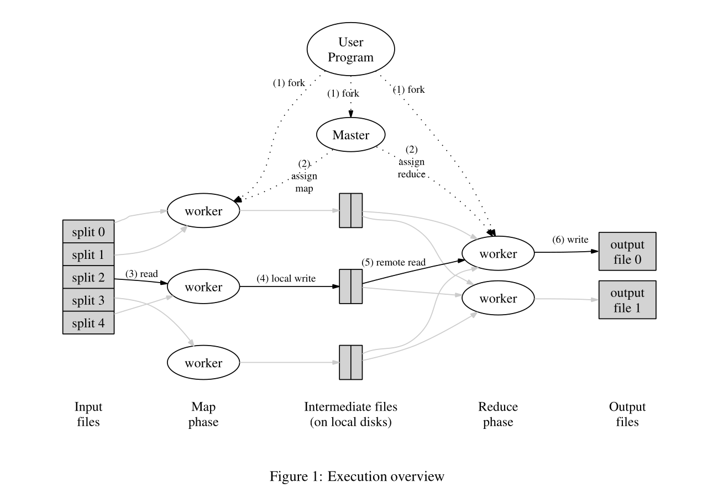

# Lab 1

## **Lab 1 MapReduce**

### 编程模型

Map函数是由用户设计，将输入对传入Map函数产生了中间键值对(intermediate key/value pairs),以相同的键值分类出值作为Reduce函数的输入值。

Reduce函数也是有用户设计，函数接受一个中间键及该键对应的一组值。

### 执行过程

执行过程：

1. MapReduce库将输入文件分成M个分片，通常每一个分片为16MB到64MB，然后将程序复制到集群中的每一个节点。
2. 程序分为两个部分，第一个部分是master，第二部分是workers。Woker的任务是由master分配的。master会选择空闲的Worker去执行map任务或者是reduce任务。
3. 一个被分配到 map 任务的工作线程读取对应输入切片（input split）的内容。它从输入数据中解析出键值对，并将每一对键值传递给用户定义的 Map 函数。Map 函数产生的中间键值对被缓存在内存中。
4. 定期地，缓冲的键值对会被写入本地磁盘，并通过分区函数划分为 R 个区域。这些缓冲的键值对在本地磁盘上的位置会被传回给主节点，主节点负责将这些位置转发给 reduce 工作节点。
5. 当 reduce 工作节点收到主节点关于这些位置的通知时，它通过远程过程调用（RPC）从 map 工作节点的本地磁盘读取缓冲数据。**当 reduce 工作节点读取完所有中间数据后，它会根据中间键对数据进行排序，以便将相同键的所有数据分组在一起**。排序是必要的，因为通常许多不同的键会映射到同一个 reduce 任务。如果中间数据量太大，无法完全放入内存，则会使用外部排序。
6. reduce 工作节点遍历排序后的中间数据，对于遇到的每个唯一的中间键，它将该键及其对应的中间值集合传递给用户定义的 Reduce 函数。Reduce 函数的输出会被追加到该 reduce 分区的最终输出文件中。
7. 当所有的 map 任务和 reduce 任务都完成后，主节点会唤醒用户程序。此时，用户程序中的 MapReduce 调用会返回，控制权将交还给用户代码。

### 设计：

1. Master任务：
    1. 将输入数据划分成多个input splits，并将每一个Map任务分配给集群中空闲的工作节点，以及在Map任务处理结束之后，Master将Map任务阶段的中间数据分配给相应的Reduce任务。然后，Master 节点负责将这些 **Reduce 任务** 分配给工作节点。
    2. 任务监控：监控所有的Map和Reduce任务的执行过程。它跟踪每一个任务的状态，包括任务是否完成，是否进行中，或者是否失败。如果任务失败的话，需要将任务重新分配给其他的空闲的工作节点。
2. Map任务：
    1. 从输入数据源中读取数据，每个 **Map Task** 会解析输入数据，并根据用户定义的 **Map 函数**，对每条数据记录进行处理。这个处理通常是将原始输入数据转换为中间的键值对（key-value pairs）。
    2. 分区和缓存，为了将中间的键值对传输给Reduce任务处理，Map任务会将中间键值对通过分区函数将数据分配给不同的Reduce任务中。

### **Q&A**

**Q:** 由于Map函数产生的中间的键值对是无序的且传入Reduce函数的输入是以相同的中间键的值,那么将无序的中间值排序成有序是谁的任务？

**A:** Reduce任务，Reduce任务包含三个子任务:

1. Reduce Task 从多个 Map Task 中拉取中间数据 
2. 拉取到的数据中，所有具有相同键的键值对会自动分组
3. Reduce Task 接收分组后的键值对，并传递给 Reduce 函数进行处理

**Q:** Map函数的中间键值对是随意地储存暂时文件中，还是以特定的分类存储的？

**A:** Map函数所产生的中间键值对需要使用分区函数对中间的键值对进行分类。**分区函数**会将**键的哈希值**作为依据，将键值对均匀地分配到不同的分区。这确保了每个分区存储了属于同一个 reduce 任务的数据。

分区函数可以有效避免相同的键值储存在不同的暂存文件中，而无法避免不同的键值存储在同一个文件中

**Q:** 当两个不同的键值的哈希值相同的话，那么它们不是分配到相同的暂存文件中，这样不会影响后期Reduce的工作吗？

**A:** 如果发生哈希冲突的话，Reduce阶段需要对键值进行排序。这样相同的键值的所有值会交给一个Reduce任务处理。

**Q:** 如果暂存文件名格式为`mr-x-y` （X，Y分别为Map任务号和Reduce任务号），那么相同键值的键值对不是会储存在不同的文件中吗？例如两个a分别被map-1和map-2任务处理，那么它们分别不是存储在mr-1-y和mr-2-y中了吗？

**A:** 这样并不会影响Reduce任务处理，因为它们会存储在相同序号为Y的Reduce桶中，那么master在分配给reduce worker时会将该桶一并传入。

**Q:** 如果Worker由于网络的波动或者是资源的竞争的话，导致Worker完成的中间的键值对的文件或者最终的文件延迟返回给Master的话，那么Master是接受还是拒绝呢？

**A:** Map任务保存的中间的键值对文件返回给Master是可以接受的。

- Worker将这些文件名以mr-X-Y来唯一标识的，那么Map 输出文件通常是幂等的（**幂等性(Idempotence) 是一个系统或操作的重要特性，指无论某个操作执行一次还是多次，其效果相同**）。
- Master如果接受两个分派给相同的文件的中间的键值对文件时，它会拒绝第二个中间键值对的文件，避免了后续Reduce任务处理

Reduce任务会拒绝这些延迟返回的最终文件，